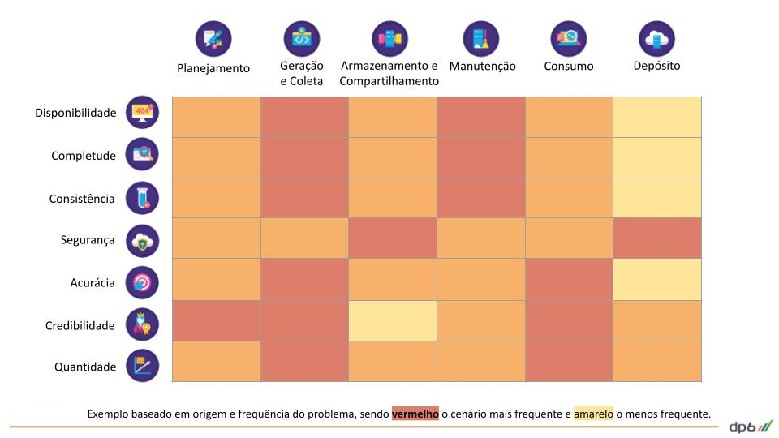

# penguin-datalayer-collect

O penguin-datalayer-collect é um modulo do ecossitema raf-suite criado pela DP6 para garantir a qualidade dos dados ([Data Quality](https://en.wikipedia.org/wiki/Data_quality)) nos projetos de engenharia de dados implementados nos clientes da DP6, atráves de monitoramento e pipe-lines automatizadas de dados.

## Ecossistema raft-suite



# Setup penguin-datalayer-collect

## 1. Requisitos para utilização
### 1.1 Produtos do GCP
* Cloud Storage
* Cloud Function
* Bigquery
* Service account

### 1.2 Dependências ambiente local
1. [Google Cloud SDK ](https://cloud.google.com/sdk/docs/install?hl=pt-br)
2. Pacotes zip, unzip e curl
3. [Criar service Account](https://cloud.google.com/iam/docs/creating-managing-service-accounts) com as permissões (Storage Object Admin, Cloud Functions Admin, BigQuery Admin e Service Account User)
4. Variável [GOOGLE_APPLICATION_CREDENTIALS](https://cloud.google.com/docs/authentication/getting-started#setting_the_environment_variable)
5. Instalar o [Terraform](https://www.terraform.io/downloads.html)

*Observação:* Utilizando o ambiente no [Google Cloud Shell](https://cloud.google.com/shell/docs) não é necessário fazer os **1** e **4**

## 2. Instalando o penguin-datalayer-core
Clonando o projeto git
```console
git clone https://github.com/DP6/penguin-datalayer-collect.git
```

Fazer deploy no GCP usando o Terraform
```console
sh terraform_deploy.sh
```

## 3. Configurando a tag no GTM

TODO

```html
<script>
	/*
	*Tag responsável por enviar a camada de dados para o Penguin-datalayer-collect
	*/
	analyticsHelper.safeFn('Penguin Datalayer Collect ', function(helper){
		// Array do dataLyer configurado para o GTM
		var body = dataLayer;

		if (helper.cookie('penguin_datalayer_collect') === 'true') {
			var request = new XMLHttpRequest();
			request.open("POST", {{endpoint - penguin-datalayer - collect}} + "?schema="+ {{schema}} , true); // Os dados de validação podem ser enriquecidos com dados de negocios enviados como queryString
			request.setRequestHeader('Content-Type', 'application/json');
			request.onreadystatechange = logHttpResponse;
			request.send(JSON.stringify(body));
		}

		function habilitarAmostragemValidacao() {
			function random(min, max) {
				min = Math.ceil(min);
				max = Math.floor(max);
				return Math.floor(Math.random() * (max - min)) + min;
			}
				var sample = 1;
				var domain = {{Cookie - Domínio}} ? {{Cookie - Domínio}} : 'auto';
				
				if (!helper.cookie('penguin_datalayer_collect')) {
					if (random(0, 100) <= sample) {
						helper.cookie('penguin_datalayer_collect', 'true', {'exdays': 1, 'domain': domain});
					} else {
						helper.cookie('penguin_datalayer_collect', 'false', {'exdays': 1, 'domain': domain});
					}
				}
			}
		}

		function logHttpResponse() {
			if ({{Debug Mode}}) {
				console.log('Penguin-datalayer-collect - Status: ', this.status);
				console.log('Penguin-datalayer-collect - Object dataLayer:', window.dataLayer);
				console.log(JSON.stringify(window.dataLayer));
			}
		}
   });
</script>
```

## 4. Enriquecendos os dados com informações de negócio 
TODO 

## 5. Criando o dashboard de acompanhamento
TODO

## 6. Como contribuir
TODO
### 6.1 Referências
* https://www.conventionalcommits.org/en/v1.0.0/
* https://github.com/semantic-release/semantic-release

Power by: DP6 Koopa-troopa Team
Suporte: koopas@dp6.com.br


